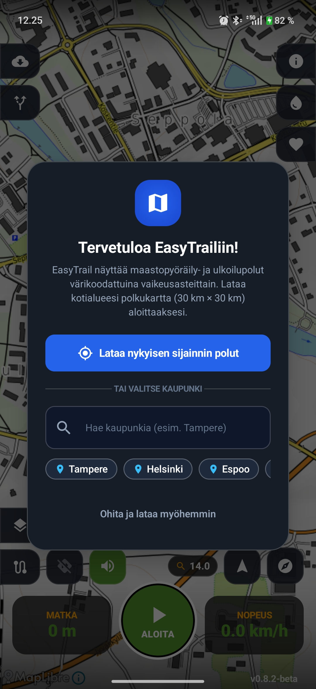
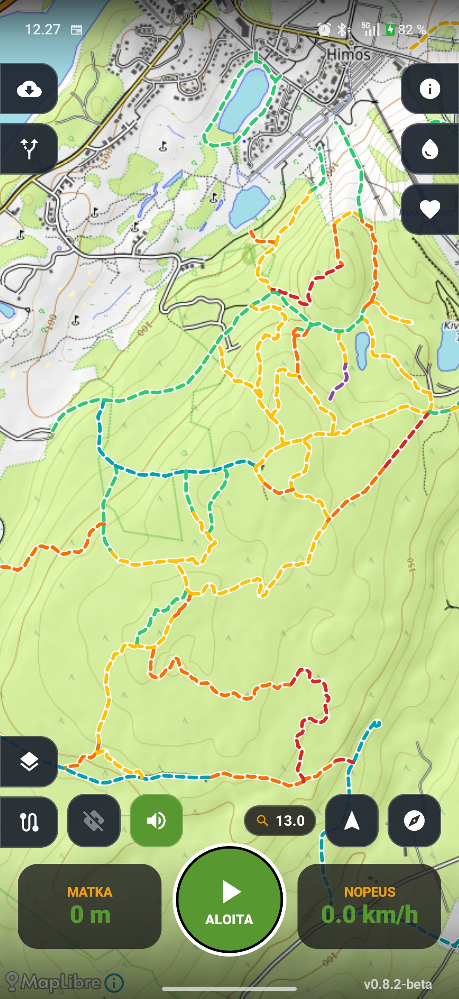
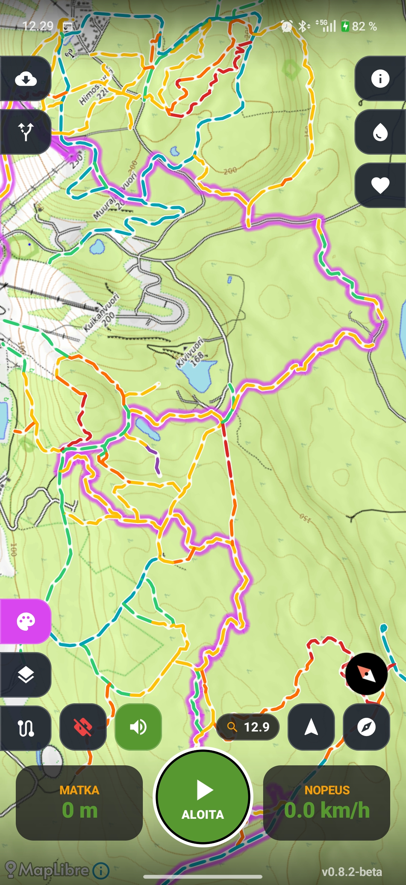
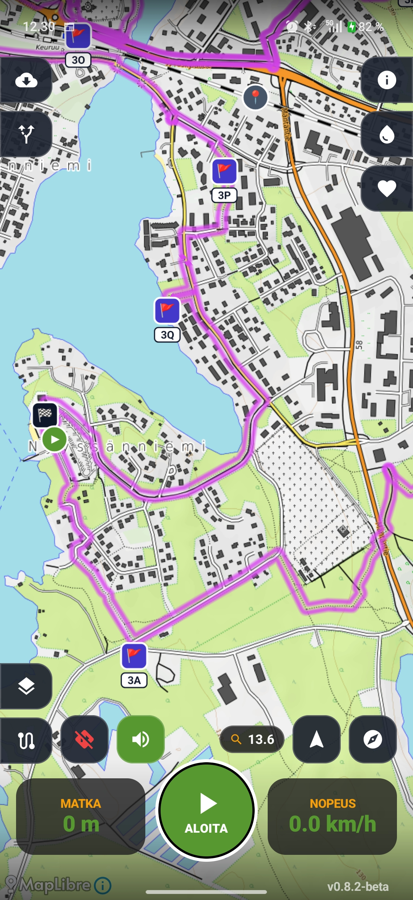
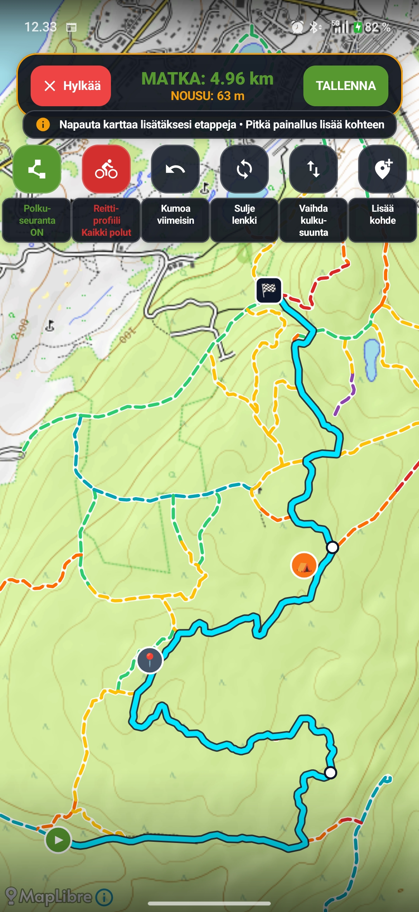
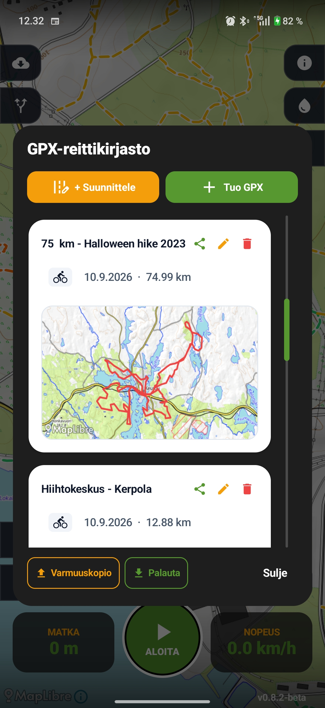
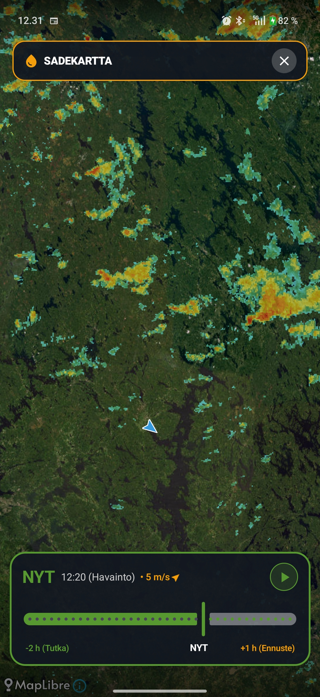
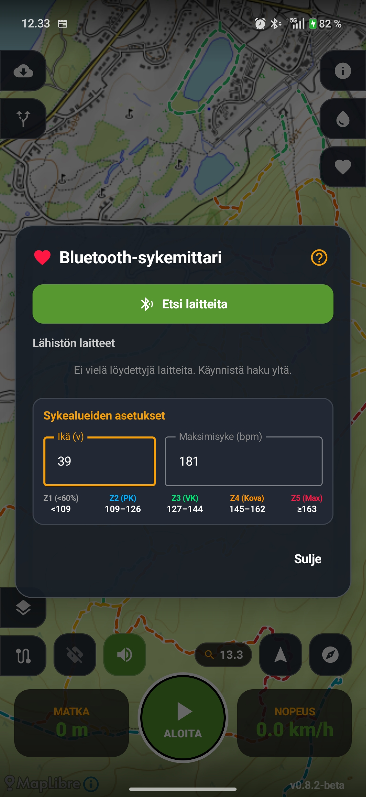

# EasyTrail – Kattava käyttöohje ja ominaisuuskuvaus

Helppokäyttöistä, varmaa ja selkeää maastonavigointia.  
*EasyTrail* on suomalaisiin maasto-olosuhteisiin suunniteltu Android-sovellus maastopyöräilyyn, polkujuoksuun, vaellukseen ja ulkoiluun.

---

## 1. Johdanto ja sovelluksen käyttöönotto

### Sovelluksen tarkoitus ja kohderyhmä
EasyTrail on kehitetty **maastopyöräilijöille, polkujuoksijoille, vaeltajille ja luonnossa liikkujille**, jotka tarvitsevat maastossa selkeän, reaaliaikaisen ja toimintavarman karttanäkymän. Sovellus yhdistää selkeät maastokartat, värikoodatut polkujen vaikeusasteet, Ilmatieteen laitoksen (FMI) sadetutkan sekä automaattiset ukkoshälytykset.

  

### Ensikäynnistys ja alustus
Ensimmäisellä käynnistyskerralla EasyTrail opastaa sinut sovelluksen käyttöön:
1. **Sijaintiluvat**: Myönnä sovellukselle tarkan GPS-sijainnin lupa karttanavigointia varten.
2. **Taustasijainti**: Valitse järjestelmän lupakyselyssä **"SALLI AINA"** (Allow all the time). Tämä on välttämätöntä, jotta reitintallennus, kilometriväliajat sekä sade- ja ukkosvaroitukset toimivat katkeamatta, kun puhelin on taskussa ruutu pimeänä.
3. **Polkukartan aluelataus (Onboarding)**: Voit ladata kotikaupunkisi tai GPS-sijaintisi pohjalta lähialueesi $30\text{ km} \times 30\text{ km}$ polkukartan suoraan laitteen muistiin, jotta polut näkyvät välittömästi ilman verkkoyhteyttä.

---

## 2. Karttapohjat, maastonäkymät ja polut

EasyTrail tarjoaa neljä lennosta vaihdettavaa karttapohjaa sekä erillisen **MTB-polkukerroksen**, joka visualisoi polut niiden teknisen vaikeusasteen mukaan.

  

### Karttapohjat
Voit vaihtaa karttapohjaa päänäkymän karttatyyppipainikkeesta:

| Karttapohja | Tietolähde | Ensisijainen käyttötarkoitus |
| :--- | :--- | :--- |
| **Maasto** | OpenTopoMap | Yleinen maastonavigointi, korkeuserot ja maastonmuodot. |
| **Satelliitti** | Esri World Imagery | Ilmakuvakartta maaston avoimuuden ja ympäristön tarkasteluun. |
| **Tiekartta** | OpenStreetMap | Selkeä katu- ja tieverkostokartta siirtymille ja taajamiin. |
| **Suunnistus** | MapAnt Suomi | Yksityiskohtainen suunnistuskartta mikromaaston ja pienten urien havainnointiin. |

---

### Polkujen luokittelu kartalla
Karttapohjan päällä esitetään selkeä katkoviivaistettu polkukerros, joka luokittelee polut niiden kansainvälisen vaikeusasteen (`mtb:scale`) mukaan:

| Värimerkintä | Vaikeusaste ja maaston kuvaus |
| :--- | :--- |
| 🔷 **Syaani** | Erittäin helppo, tasainen ura tai neulaspolku (`mtb:scale 0-`). |
| 🟢 **Vihreä** | Helppo polku, vain vähän juuria tai kiviä (`mtb:scale 0, 0+, 1-`). |
| 🟡 **Keltainen** | Keskivaikea maastopolku, jonkin verran juurakkoa ja kivikkoa (`mtb:scale 1, 1+, 2-`). |
| 🟧 **Oranssi** | Vaikea polku, vaatii pyöränhallintaa ja maastokokemusta (`mtb:scale 2, 2+, 3-`). |
| 🔴 **Punainen** | Erittäin vaikea, jyrkkä tai erittäin kivikkoinen/juurakkoinen polku (`mtb:scale 3, 3+, 4-`). |
| 🟣 **Violetti** | Vaativin / lähes ajokelvoton singletrack (`mtb:scale 4, 4+, 5`). |
| ⚪ **Harmaa** | Luokittelematon polku tai muu ura. |

---

## 3. Reitin tallennus ja ajonäyttö

EasyTrail tarjoaa selkeän kenttänäytön suoritusten tallennukseen ja ajonaikaisten mittarien seurantaan.

  

### Ajonaikaiset mittarit
Ruudun ylä- ja alareunassa esitetään reaaliaikaisesti:
- Hetkellinen ja maksiminopeus (km/h)
- Kuljettu matka (km) ja kestoaika (t:min:s)
- Kertynyt nousumetrimäärä (+m) sekä reaaliaikainen korkeusprofiili
- Sykelukema ja sykealue (jos BLE-sykevyö on yhdistetty)

### Tallennuksen hallinta ja pikatoiminnot
- **TALLENNA**: Aloittaa uuden tallennuksen ja luo automaattisesti aloituspisteen.
- **TAUKO / JATKA**: Voit tauottaa tallennuksen tauon ajaksi.
- **LOPETA & TALLENNA**: Avaa tallennusikkunan, jossa voit nimetä ajon, valita lajin (*Pyöräily, Kävely & Vaellus, Juoksu, Hiihto, Muu*) ja lisätä muistiinpanoja.
- **🎯 Keskitä**: Keskittää kartan välittömästi omaan sijaintiisi.
- **🧭 Suuntaus**: Vaihtaa pohjoissuunnan (*North-up*) ja ajosuunnan (*Heading-up*) välillä.
- **🔊/🔇 Äänemykistys**: Kytkee puheilmoitukset päälle tai pois yhdellä napautuksella.

### Iskunkestävä automaattipuskurointi (Crash-Proof Auto-Save)
Jokainen tallennettu GPS-piste kirjoitetaan välittömästi laitteen sisäiseen hätämuistiin. Jos puhelimen akku loppuu tai kamerasovellus sammuttaa EasyTrailin taustalta videokuvauksen aikana, **sovellus palauttaa keskeytyneen lenkin automaattisesti** heti uudelleenkäynnistyksen yhteydessä!

---

## 4. Rastit ja reittipisteet (Waypoints)

Voit merkitä lenkin varrelle kiintopisteitä, väliaikoja, huomioita tai taukopaikkoja.

  

### Reittipisteiden hallinta
- **Lisää piste**: Voit lisätä reittipisteen päänäkymän painikkeesta omalle kohdallesi tai karttaa pitkään painamalla haluamaasi paikkaan.
- **Pistetyypit**: Lähtö, Maali, Taukopaikka, Näköalapaikka, Huomio tai Yleinen rasti.
- **Ääni-ilmoitukset**: Kun lähestyt merkittyä reittipistettä maastossa (noin 50 metrin etäisyydellä), EasyTrail antaa äänimerkin ja lukee pisteen nimen ääneen.

---

## 5. Reittisuunnittelu ja GPX-seuranta

EasyTrailin avulla voit suunnitella omia maastoreittejä tai seurata valmiita GPX-jälkiä.

  

### Reittisuunnittelutila (PLANNING)
Vaihda päänäkymän tilavalitsimesta **PLANNING**-tilaan:
1. Napauta karttaa merkitäksesi reittipisteitä.
2. Sisäänrakennettu offline-reititys laskee automaattisesti maastopyörälle sopivan reitin pisteiden välille polkuverkostoa pitkin.
3. Valitse maastoprofiili tarpeesi mukaan:
   - 🟢 **Helpot**: Suosii helppoja neulaspolkuja ja hiekkateitä.
   - 🟡 **Keskivaikea**: Tasapainoinen maastopyöräilyreitti.
   - 🔴 **Kaikki polut**: Hyödyntää kaikkia polkuja ja uria.

### GPX-reitin seuraaminen ja navigointi
- Valitse valmis GPX-reitti kirjastosta ja valitse **Seuraa reittiä**.
- **Reitiltä poikkeamisvaroitus**: Jos eksyt seurattavalta reitiltä yli 30 metriä, EasyTrail tärisee ja antaa suomenkielisen puhevaroituksen (*"Varoitus: Olet poikennut reitiltä"*).
- **Risteysohjaus**: Sovellus ilmoittaa ääneen lähestyvistä polkuristeyksistä ja reittipisteistä.

---

## 6. Reittigalleria ja GPX-hallinta

Kaikki tallentamasi ja tuomasi reitit löytyvät kootusti **Reittigallerasta**.

  

### Gallerian toiminnot
- **Selaus ja hakutoiminnot**: Näe kaikkien ajojesi tilastot (matka, aika, keskinopeus, nousumetrit, päivämäärä) ja automaattisesti generoidut karttapienoiskuvat.
- **Lajin muokkaus**: Voit vaihdella suorituksen lajia (*Pyöräily, Kävely/Vaellus, Juoksu, Hiihto, Muu*).
- **GPX-tuonti ja -vienti**: Voit avata `.gpx`-tiedostoja muista sovelluksista (WhatsApp, Sähköposti, Google Drive) tai viedä omia suorituksiasi GPX-muodossa.
- **Yhteenvetokuva (Share Summary)**: Voit luoda ajostasi tyylikkään kuvan sosiaaliseen mediaan jaettavaksi, joka sisältää reittikartan ja suorituksen tilastot.

---

## 7. Reaaliaikainen sää, sadetutka ja salamahälytykset

EasyTrail tuo ajantasaisen sää- ja ukkostilanteen suoraan Ilmatieteen laitoksen (FMI) avoimesta datasta suoraan kartalle.

  

### Sadetutka ja tuuliohjattu ennuste
- **2 tunnin historia-animaatio**: Napauta tutkakuvaketta avataksesi sadetutkakerroksen. Voit toistaa sadekuurojen liikeradan animaationa aikajanaltamme.
- **Ennuste (+5 ... +60 min)**: Sovellus ennakoi sadepilvien liikesuunnan ja voimakkuuden reaaliaikaisten tuulitietojen perusteella.

### Salamahavainnot ja ukkoshälytykset
- **Salamaniskut kartalla**: Näyttää viimeisen 2 tunnin aikana havaitut salamaniskut koko Suomessa. Tuoreet iskut ($\le 5\text{ min}$) välähtävät keltaisina kipinöinä (`⚡`), ja vanhemmat ($5–12\text{ min}$) haalistuvat oransseiksi.
- **Automaattinen ukkoshälytys**: Kun salamanisku havaitaan lähialueella ($\le 60\text{ km}$):
  - Yläpalkkiin ilmestyy salamabadtge ja etäisyys iskupaikkaan.
  - Salaman pamahtaessa lähietäisyydellä ($\le 10\text{ km}$) puhelin tärisee napakasti ja antaa puhevaroituksen (*"Varoitus: Voimakasta salamointia 4 kilometrin etäisyydellä"*).

---

## 8. Sykeanturit ja laiteparit (Bluetooth LE)

EasyTrail tukee standardeja Bluetooth Low Energy (BLE) -sykevöitä ja -antureita.

  

### Sykevyön yhdistäminen
1. Avaa asetuksista **Sykeanturi (BLE)** ja käynnistä haku.
2. Valitse sykevyösi listalta.
3. Sovellus muistaa laitteesi ja yhdistää siihen jatkossa automaattisesti sovelluksen käynnistyessä.

### Sykealueet ja varoitukset
Asetettujen iän ja maksimisykkeen perusteella sovellus laskee 5 sykealuetta:
- **Z1 (Lämmittely)**: 50–60 % Max HR
- **Z2 (Peruskestävyys)**: 60–70 % Max HR
- **Z3 (Aerobinen)**: 70–80 % Max HR
- **Z4 (Anaerobinen)**: 80–90 % Max HR
- **Z5 (Maksimirasitus)**: 90–100 % Max HR – Sovellus varoittaa puheäänellä, kun liikut maksimisykkeelläsi.

---

## 9. Offline-kartat, datansäästö ja järjestelmäluvat

EasyTrail on suunniteltu toimimaan täydellisesti ilman verkkoyhteyksiä.

### Offline-kartta-alueen lataus
1. Avaa valikosta **Lataa offline-kartta**.
2. Rajaa haluamasi maastoalue ruudulla näkyvän kehikon sisään (enimmäiskoko 500 km² per alue).
3. Valitse haluamasi karttatasot (*Maasto, Satelliitti, Tiekartta, Suunnistus*) ja aloita lataus.
4. Voit tarkastella ja nimetä ladattuja alueita **Ladatut offline-kartat** -valikosta.

### Suomenkielinen puheohjaus (Text-To-Speech)
Sovellus ilmoittaa ääneen kilometriväliajat, reitiltä poikkeamiset, ukkos- ja sadevaroitukset sekä akkuvaroitukset (20 % ja 10 %). Voit mykistää puheäänet milloin tahansa karttanäytön kaiutinpainikkeesta.

### Vaadittavat Android-luvat ja akkuoptimointi

| Lupa | Käyttötarkoitus |
| :--- | :--- |
| **Sijainti** | GPS-sijainnin hakeminen kartalle ja reitin seurantaan. |
| **Taustasijainti** | **Tärkeä!** Valitse **"SALLI AINA"**. Varmistaa reitin katkeamattoman tallennuksen ja säähälytykset, kun puhelin on taskussa ruutu pimeänä. |
| **Bluetooth** | BLE-sykevyön etsiminen ja yhdistäminen. |
| **Ilmoitukset** | Aktiivisen tallennuksen tilapalkki-ilmoitus. |

> [!IMPORTANT]
> **Akkuoptimointien poistaminen**: Varmista puhelimesi asetuksista (**Asetukset ➔ Sovellukset ➔ EasyTrail ➔ Akku / Virransäästö**), että sovelluksen akkuasetukseksi on valittu **"Ei rajoituksia"** (Unrestricted). Tämä estää valmistajien aggressiivista virransäästöä sammuttamasta taustapaikannusta kesken lenkin.

---

*EasyTrail – Suomalaiseen maastoon tehty.*
